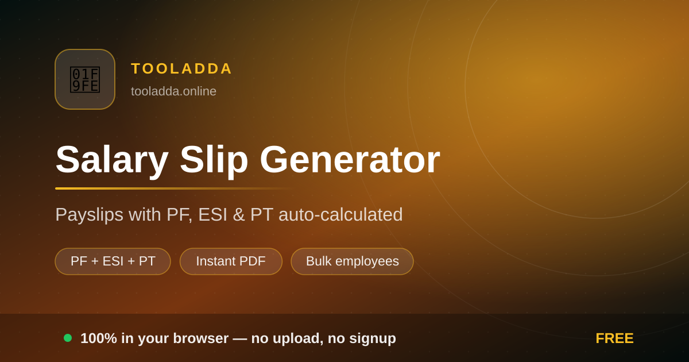
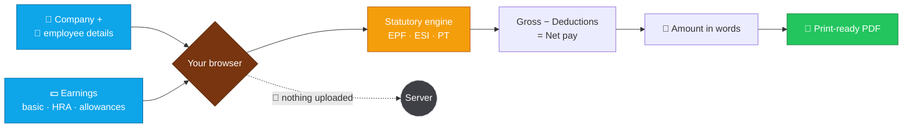

<div align="center">

<a href="https://tooladda.online/salary-slip-generator.html"></a>

# 🧾 Salary Slip Generator

### Payslips with PF, ESI and professional tax worked out for you

[](https://tooladda.online/salary-slip-generator.html)
[](https://tooladda.online/salary-slip-generator.html)
[](https://tooladda.online/salary-slip-generator.html)


</div>

---

## ⚡ 10-second version

A payslip is not a pretty table — it's arithmetic that has to *add up*. Enter the earnings once at **[tooladda.online/salary-slip-generator.html](https://tooladda.online/salary-slip-generator.html)** and the deductions side fills itself in: PF on the right wage base, ESI only if the employee is eligible, professional tax from the state slab. Gross − deductions = net, every time.

> [!IMPORTANT]
> Payslips contain names, employee IDs, bank details and exact salaries. This tool runs **entirely in your browser** — there is no upload, no account, and no server holding a spreadsheet of your team's pay.

---

## 💰 Where the money actually goes

The number that surprises every first-time employee is the gap between CTC and bank credit. Here's the mechanism, with the statutory bases that most templates get wrong:

| Component | How it's computed | The detail people miss |
|:--|:--|:--|
| **EPF (employee)** | 12% of PF wages | The statutory wage ceiling is **₹15,000/month**. Above it, employers may cap the contribution at ₹1,800 or contribute on full basic — both are legal, and they produce very different payslips. |
| **EPF (employer)** | 12%, split 8.33% pension + 3.67% PF | This is employer cost, not an employee deduction. It belongs in CTC, **not** in the deductions column. |
| **ESI** | 0.75% employee + 3.25% employer | Applies only while gross wages are **≤ ₹21,000/month**. Cross the limit mid-contribution-period and the rules still keep the employee in until the period ends. |
| **Professional tax** | Flat state slab | State-specific, not national. Maharashtra runs ~₹200/month with a higher February figure; several states don't levy it at all. |
| **TDS** | Per the employee's regime & declarations | Depends on old vs new regime and declared investments — no template can guess it. |

**The classic mistake:** putting the *employer's* 12% PF into the employee's deductions. That single error understates net pay by thousands and makes the slip fail any audit.

<div align="center">

[](https://tooladda.online/salary-slip-generator.html)

</div>

---

## 🧭 How it works



---

## ✨ What's inside

<table>
<tr>
<td width="50%" valign="top">

### ⚙️ Statutory auto-calculation
PF, ESI and PT computed from the bases you set — with the wage ceilings applied, not ignored. Override any figure when your company's policy differs.

</td>
<td width="50%" valign="top">

### 🧩 Custom earnings & deductions
Add conveyance, LTA, special allowance, loan recovery, advance adjustment. Real payrolls have odd lines; the form doesn't fight you.

</td>
</tr>
<tr>
<td width="50%" valign="top">

### 🔢 Amount in words
Auto-generated in the Indian numbering system — lakh and crore, not million. Small thing, but it's the line auditors read first.

</td>
<td width="50%" valign="top">

### 🏢 Company branding
Logo, address, and a clean layout that looks like it came from an HR system rather than a Word file someone forwarded.

</td>
</tr>
<tr>
<td width="50%" valign="top">

### 📄 Real-text PDF
Selectable, searchable text — so a bank or landlord verifying the slip can copy from it. Not a screenshot pretending to be a document.

</td>
<td width="50%" valign="top">

### 🔒 No account, no retention
Nothing is stored. For a small business without payroll software, this is the difference between issuing slips and uploading your team's salaries to a stranger.

</td>
</tr>
</table>

---

## 🛠️ Who uses it

| Situation | What they do |
|:--|:--|
| 🏪 **Small business, 5–40 staff** | Issue proper monthly slips without paying for payroll software. |
| 🧑‍💼 **HR at a startup** | Bridge the gap before a payroll product is set up. |
| 🏦 **Employee applying for a loan** | Reissue a lost slip the bank is asking for. |
| 🛂 **Visa or rental application** | Produce the three months of slips that get requested every time. |
| 🧾 **CA / consultant** | Generate slips for multiple client employees quickly. |
| 🏠 **Household or shop employer** | Give a domestic or retail employee a real, documented payslip. |

---

## 📖 Four steps to a signed slip

```
1.  Open     →  tooladda.online/salary-slip-generator.html
2.  Company  →  name, address, logo, pay month
3.  Earnings →  basic + HRA + allowances (deductions fill in automatically)
4.  Download →  PDF, check gross − deductions = net, issue
```

**[▶ Open the generator — tooladda.online/salary-slip-generator.html](https://tooladda.online/salary-slip-generator.html)**

> [!WARNING]
> Statutory rates, wage ceilings and state PT slabs **change**. Treat the defaults as a sensible starting point, not legal advice, and confirm current figures with your CA or the EPFO/ESIC notifications before you file anything on the back of them.

> [!TIP]
> Keep one slip as your reference template and reuse the same structure every month. Payslips whose component names drift month to month are the ones that get questioned during due diligence.

---

## ❓ FAQ

<details>
<summary><b>Is it free, and is there a watermark?</b></summary><br>
Free, and no watermark. No per-slip charge and no cap on how many employees you generate for.
</details>

<details>
<summary><b>Why is my net pay lower than salary ÷ 12?</b></summary><br>
Because CTC includes the employer's PF contribution, gratuity provision and often insurance — costs your employer pays that never pass through your bank account. Then your own PF, PT and TDS come out of gross. The slip shows each step so the gap stops being mysterious.
</details>

<details>
<summary><b>Should the employer's PF go in deductions?</b></summary><br>
No. Only the employee's 12% is a deduction. The employer's share is company cost and belongs in the CTC breakup, not the payslip's deduction column. Mixing them is the most common payslip error there is.
</details>

<details>
<summary><b>Is ESI deducted from everyone?</b></summary><br>
No — it applies while gross wages stay within the ₹21,000/month limit. Above that the employee is outside ESI, though transition rules apply if they cross mid-period.
</details>

<details>
<summary><b>Can I override an auto-calculated figure?</b></summary><br>
Yes. Every statutory line is editable, because real company policies deviate from the defaults — capping PF at ₹1,800 being the obvious example.
</details>

<details>
<summary><b>Can I generate slips for a whole team?</b></summary><br>
Yes — run through each employee and download their slip. Nothing is stored between them, so nothing leaks between them either.
</details>

<details>
<summary><b>Is a self-generated payslip acceptable to banks?</b></summary><br>
A payslip issued by an employer is valid regardless of which software produced it — what matters is that it's genuine, signed/stamped, and matches bank credits and Form 16. Fabricating a slip for income you didn't earn is fraud, and the bank statement cross-check is exactly where it comes apart.
</details>

---

## 🔬 Under the hood

- Vanilla JavaScript, single page, **no backend** — salary data has nowhere to travel to.
- Deduction engine keeps wage ceilings and eligibility limits as editable parameters rather than magic numbers.
- PDF generated client-side with real text; A4 print layout.
- Offline-capable PWA once loaded.

---

## 🧰 Related ToolAdda tools

<div align="center">

[](https://tooladda.online/rent-receipt-generator.html)
[](https://tooladda.online/resume-builder.html)
[](https://tooladda.online/pdf-merge.html)
<br>
[](https://tooladda.online/pdf-compress.html)
[](https://tooladda.online/pdf-password-protector.html)
[](https://tooladda.online/signature-resizer.html)

</div>

---

<div align="center">

### Gross in. Statutory handled. Net out.

[](https://tooladda.online/salary-slip-generator.html)

<sub>Part of <b><a href="https://tooladda.online">ToolAdda</a></b> — 130+ free, private, browser-based tools.<br>
No signup · No uploads · No nonsense.</sub>

</div>
